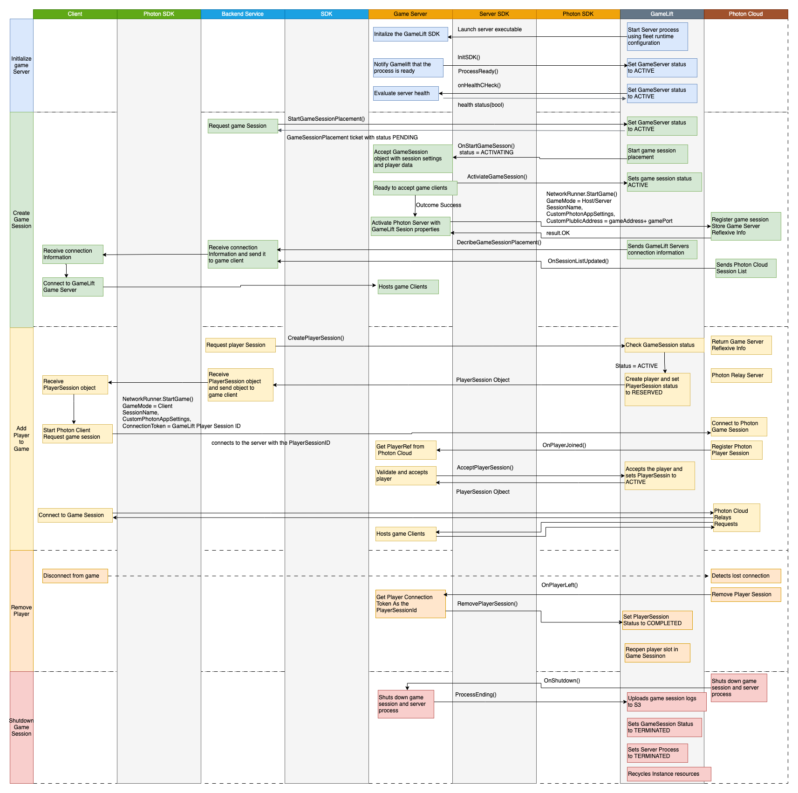
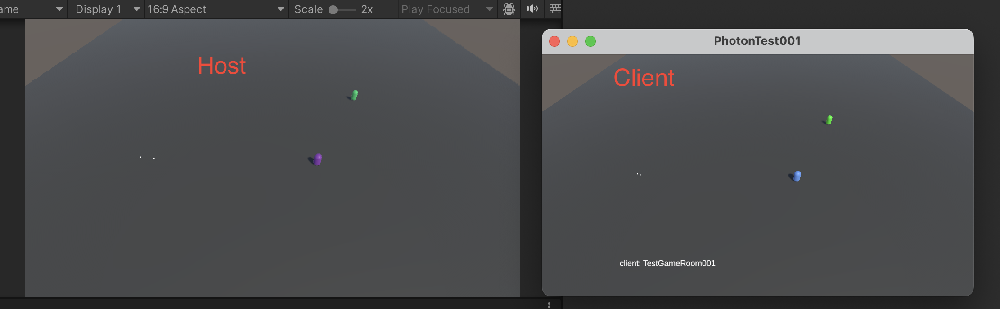

# gamelift-photon-integration-sample

## Intro

This project is designed to demonstrate how to integrate a Photon project with Amazon GameLift Servers. After downloading the project, the mode will be automatically set according to your operating system. All you need to do is package it.

```
#if UNITY_STANDALONE_LINUX
    _isDedicatedServer = true;
    _isDedicatedHost = false;
#endif

#if UNITY_STANDALONE_OSX
    _isDedicatedServer = false;
    _isDedicatedHost = true;
#endif

#if UNITY_EDITOR
    _isDedicatedServer = false;
    _isDedicatedHost = false;
#endif
```

## Interaction Chart



As you can see, the entire process is divided into several parts:

1. Initializing the game server
2. Creating a game session
3. Adding players to the game
4. Players leaving the session
5. Closing the game session


## Testing

### Anywhere (sdk5)

Below are the main CLI steps for testing in an Anywhere environment.

```
# step 1: create custom location
aws gamelift create-location \
--location-name custom-location-1

# step 2: create fleet
aws gamelift create-fleet \
--name myFleet001 \
--compute-type ANYWHERE \
--locations "Location=custom-location-1"

# step 3: get the fleetid from step 2 and register local compute
aws gamelift register-compute \
--compute-name benxiwanAnywhere001 \
--fleet-id <fleetId Arn> \
--ip-address <public ip address> \
--location custom-location-1

# step 4: generate auth token
aws gamelift get-compute-auth-token \
--fleet-id <fleetId Arn> \
--compute-name benxiwanAnywhere001

# step 5: use the auth token to access gamelift server in Unity
# this auth token is for DS
string authToken = "<auth token>";

# step 6: create game session with game properties
# this gameSessionId is for Client
aws gamelift create-game-session \
--maximum-player-session-count 10 \
--fleet-id <fleetId Arn> \
--game-properties {"Key": "SessionName", "Value": "TestGameRoom001"} \
--location custom-location-1 
```

### Managed EC2

Below are the main CLI steps for testing in a Managed EC2 environment.

```
# step 1: upload build with basic information
aws gamelift upload-build \
--name "unity-photon-v1" \
--build-version "1.8" \
--build-root "./Builds/linux" \
--operating-system AMAZON_LINUX_2 \
--server-sdk-version "5.0.0" \
--region <aws-region-code>

# step 2: create fleet, need build id from previous step
# for port, refer: https://doc.photonengine.com/fusion/current/manual/connection-and-matchmaking/tcp-and-udp-port-numbers
aws gamelift create-fleet \
--name "photon-fleet.v1" \
--build-id <buid id> \
--certificate-configuration 'CertificateType=GENERATED' \
--instance-role-arn '<custom-instance-role>' \
--ec2-instance-type c5.xlarge \
--ec2-inbound-permissions 'FromPort=4530,ToPort=4540,IpRange=0.0.0.0/0,Protocol=TCP' \
--ec2-inbound-permissions 'FromPort=5050,ToPort=5060,IpRange=0.0.0.0/0,Protocol=UDP' \
--ec2-inbound-permissions 'FromPort=27000,ToPort=27010,IpRange=0.0.0.0/0,Protocol=UDP' \
--fleet-type SPOT \
--runtime-configuration 'ServerProcesses=[
{LaunchPath=/local/game/TestServer.x86_64,ConcurrentExecutions=1}
]' \
--region <aws-region-code>

# step 3: create game session, need fleetid from previus step
# this gameSessionId is for Client
aws gamelift create-game-session \
--maximum-player-session-count 10 \
--fleet-id <fleet id arn> \
--game-properties {"Key": "SessionName", "Value": "TestGameRoom001"} \
--region <aws-region-code>
```

